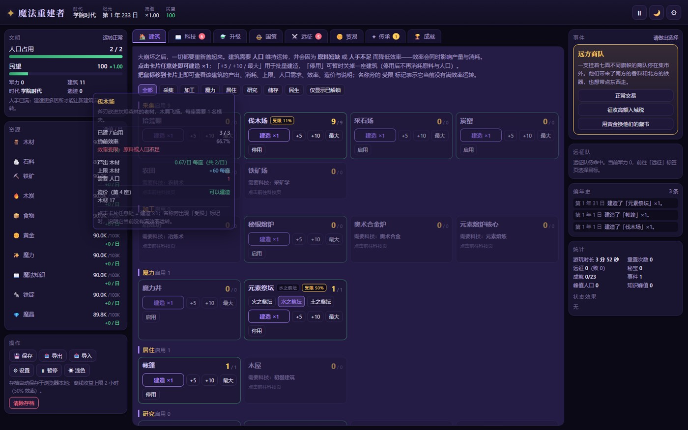
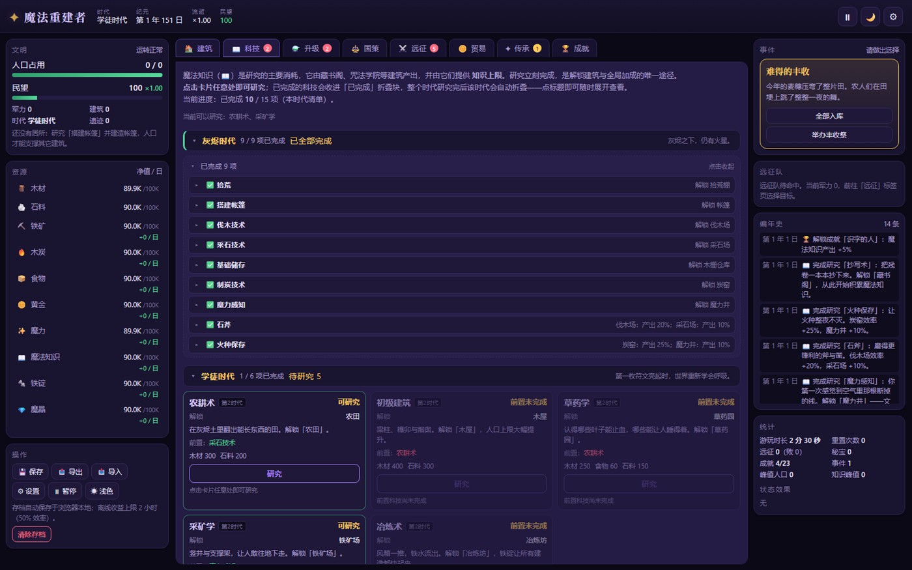
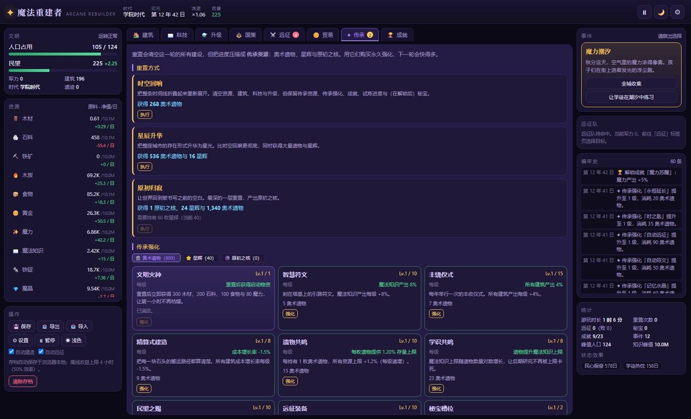
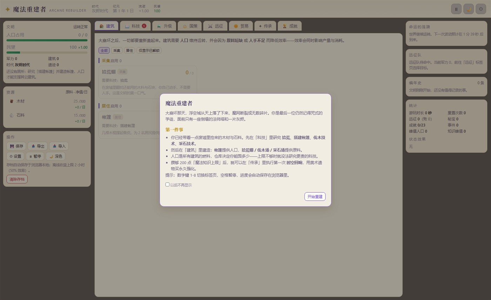

# 魔法重建者 · Arcane Rebuilder

一个**中世纪魔法题材的单机放置（Idle / Incremental）建造游戏**，纯前端实现、零依赖、可离线运行。
玩法结构参考了同类网页放置游戏（人口约束 → 建筑效率 → 科技解锁 → 多层重置传承），
但世界观、资源链、建筑、科技、事件与全部数值都是为本作重新设计的。

## 世界观

大崩坏那天，浮空城从天上落了下来，魔网断裂成无数碎片。
你是最后一位仍然记得咒式的学徒，面前只有一座倒塌的法师塔和一片灰烬。
重新开采、重新冶炼、重新刻下符文，然后——把整条时间线折叠起来，再展开一次。

## 快速开始

* **在线试玩**：<https://mzgz-xcxd.github.io/arcane-rebuilder/>
  （由本仓库 `main` 分支根目录经 GitHub Pages 直接托管，纯静态页面、不需要任何构建步骤；更新 `main` 后会自动重新发布。）
* **本地运行**：双击 `index.html`，或把整个目录拖进浏览器。全部脚本都是普通 `<script>`，`file://` 下可直接运行，不需要本地服务器。
* **单文件版**（方便分享或离线保存）：执行 `node tools/build-single-file.js`，脚本会把样式与全部脚本内联，生成 `dist/arcane-rebuilder.html` 这一个独立文件。

存档保存在浏览器 `localStorage`，关闭页面后再次打开会结算离线收益；也可以在「设置」里导出 / 导入存档文本。

## 界面截图

建筑页的卡片只保留名称与操作，细节（产出、消耗、上限、人口、效率、造价、说明）都在鼠标悬浮浮窗里：



科技页按时代折叠，研究完的科技自动收进「已完成」折叠块，点标题随时展开：



传承重置与浅色主题：





## 主要系统

| 系统 | 说明 |
| --- | --- |
| 资源链 | 20 种资源：木材/石料/铁矿/木炭/食物/黄金 → 铁锭/魔晶/符文/秘银 → 奥术合金/星尘/以太/贤者之石，以及魔力、魔法知识、政策点与 3 种传承资源 |
| 人口约束 | 几乎所有建筑都需要人口维持；住房提供人口，人手不足时**所有**建筑效率同步下降 |
| 建筑效率 | 效率同时受「原料短缺」与「人手不足」限制，并迭代收敛；效率会同时影响产量与消耗 |
| 存量上限 | 大多数资源有上限，仓库类建筑与生产建筑本身提供上限；研究前必须先解决上限瓶颈 |
| 科技树 | 63 项科技，分 6 个时代；研究即时完成，是解锁建筑与全局加成的唯一途径 |
| 升级 | 16 项可重复升级，价格指数增长，是后期放大产能的主力 |
| 国策 | 6 条滑杆政策（税收、开采倾向、魔力配给、研究重心、尚武、元素倾向），调整消耗政策点 |
| 随机事件 | 19 个事件，多选项、即时结算与限时增益/减益（进行中的效果显示在右侧面板） |
| 遗迹远征 | 6 层遗迹，消耗物资、耗时若干游戏日，按军力判定成败，带回材料、遗物与秘宝 |
| 秘宝 | 随机词条的装备（3 槽，可扩展至 5 槽），脆弱秘宝数值更高但重置时碎裂 |
| 贸易 | 集市决定贸易规模；每种资源可设为持续买入/卖出，价格随热度浮动并缓慢回归 |
| 传承（重置） | 三层重置：时空回响 → 星辰升华 → 原初归寂，产出奥术遗物/星辉/原初之核，共 31 项永久强化 |
| 试炼 | 7 项可自选激活的严苛挑战，在对应重置中坚持到底即可永久获得奖励（星级提升重置收益） |
| 成就 | 23 项自动检测成就，附带永久被动 |
| 自动化 | 「自动符文」「自动远征」解锁后自动购买建筑与连续远征（可在左侧关闭） |

## 上手路线（第一次游玩）

1. 「科技」→ 研究 **拾荒**、**搭建帐篷**、**伐木技术**、**采石技术**（起步木材够用）。
2. 「建筑」→ 建造 **帐篷**（提供人口）与 **拾荒棚 / 伐木场 / 采石场**。
3. 人口用完就补住房：所有建筑都需要人手维持。
4. 木头/石料撞到上限时，研究 **基础储存** 并建造 **木栅仓库**。
5. 研究 **制炭技术 → 魔力感知**，开始产出「魔力」，随后 **抄写术** 打开「魔法知识」。
6. 魔法知识上限达到 200 后，在「传承」里执行第一次 **时空回响**，用奥术遗物买永久强化。

## 文件结构

```
arcane-rebuilder/
├── index.html                  入口（双击即玩）
├── README.md
├── CHANGELOG.md                更新日志（每次改动都写在这里）
├── .gitattributes              行尾统一为 LF，二进制文件不做转换
├── .gitignore
├── css/
│   └── style.css               深色「秘法」+ 浅色「羊皮卷」双主题
├── js/
│   ├── main.js                 启动入口
│   ├── config/                 纯数据配置：资源、建筑、科技、升级、国策、传承、成就、试炼、事件、远征
│   ├── engine/                 游戏引擎（与界面完全解耦，可脱离浏览器运行）
│   │   ├── utils.js            数值格式化 / 随机 / 时间
│   │   ├── state.js            全局状态与资源管理
│   │   ├── effects.js          加成聚合（科技/升级/国策/传承/成就/试炼/秘宝/事件/建筑全局）
│   │   ├── production.js       生产核心：效率迭代、上限、民望、可见性、价格
│   │   ├── market.js           贸易与价格热度
│   │   ├── artifacts.js        秘宝生成与装备
│   │   ├── expedition.js       远征判定与结算
│   │   ├── eventengine.js      随机事件与限时效果
│   │   ├── achievements.js     成就检测
│   │   ├── actions.js          玩家操作与三层重置
│   │   ├── save.js             存档、导入导出、离线收益
│   │   └── loop.js             主循环
│   └── ui/                     界面层（原生 DOM，无框架）
│       ├── dom.js              DOM 工具、悬浮提示、DOM 补丁刷新、弹窗
│       ├── panels.js           顶栏 / 人口 / 资源 / 操作 / 事件 / 日志 / 统计 / 各类弹窗
│       ├── tab-buildings.js    建筑页
│       ├── tab-research.js     科技页（按时代折叠）与升级页
│       ├── tab-ascend.js       国策页与传承（重置）页
│       ├── tab-world.js        远征 / 贸易 / 成就页
│       └── app.js              标签页调度、事件委托、快捷键
├── tools/
│   └── build-single-file.js    单文件版打包脚本
├── dist/
│   └── arcane-rebuilder.html   打包产物（单文件版，可直接双击运行）
└── screenshots/                README 使用的界面截图
```

## 数值设计要点

* 1 秒 = 1 游戏日，360 日 = 1 年；建筑产能以「每座 / 日」为单位，早期 1/日 左右。
* 建筑成本按 `基础价 × 增长率^已建数量` 增长，增长率受科技与传承修正。
* 民望是全局产出乘数（100 民望 = ×1），并有软上限避免无限叠乘；食物见底会带来饥饿减益。
* 效率迭代：每 tick 收集所有启用建筑的产量/消耗/人口需求，迭代 3 次收敛出每座建筑的实际效率，
  因此「把所有资源都拿去造耗材工厂」会让整条产业链一起降速，需要玩家主动平衡。
* 重置收益 `≈ (ln(知识上限+1))² + 人口上限/15`，再乘上传承、成就与试炼星级加成。

## 开发与自检

* 引擎不依赖 DOM：可直接在 Node 中加载 `js/config/*` 与 `js/engine/*` 做数值模拟与平衡测试。
* UI 使用事件委托（`data-act` 属性）+ 悬浮提示（`data-tip`）。界面刷新走的是**轻量 DOM 补丁**：
  先比对新旧 HTML 字符串，相同则完全不碰 DOM；不同则逐层比对，只更新变化的文本与属性，
  尽量复用已有节点。因此按钮在刷新前后保持同一节点身份——鼠标悬停不会被打断（不闪烁），
  `mousedown` 与 `mouseup` 之间也不会因为节点被替换而丢失点击。鼠标按住期间会整体冻结重绘，
  拖动滑杆时不会被刷新打断。
* 建筑 / 科技 / 升级 / 传承卡片**整卡即主操作**（点卡片任意处 = 建造 ×1 / 研究 / 升级 / 强化），
  卡内的小按钮（批量建造、停用、模式切换）优先级更高，不会误触发主操作。
* 科技页按时代折叠：已研究的科技收进「已完成 N 项」折叠块（展开后是单行紧凑条目，
  点击某一行可展开完整说明），一个时代的科技全部研究完后该时代标题会整体折叠，
  只保留一行进度摘要，点标题随时展开回看。
* 建筑页的卡片只保留**名称、已建数量与操作按钮**，产出 / 消耗 / 上限 / 人口需求 / 效率 /
  造价 / 说明全部放进鼠标悬浮浮窗（悬停卡片即可查看），因此一屏可以放下更多建筑；
  效率不足时名称旁会出现 `受限 NN%` 标记，用于提示该建筑当前没有满效率运转。
* 浏览器控制台无报错即可运行；常用调试入口：`GameState`、`Actions`、`ProductionEngine`、`UI.render()`。

### 单文件版打包

```bash
node tools/build-single-file.js
```

脚本读取 `index.html`，把 `css/style.css` 与全部 `js/**/*.js` 内联进一个 HTML，
输出到 `dist/arcane-rebuilder.html`。只需要 Node，无需任何依赖；改了源码后重新执行一次即可。

## 兼容性

桌面与移动端浏览器（Chrome / Edge / Firefox / Safari 近两年版本）。
窄屏下三栏会自动堆叠，数字键 1-8 切换标签页，空格暂停。

## 更新日志

所有变更都记录在 [CHANGELOG.md](CHANGELOG.md)。约定很简单：

* 平时改完就把内容写进文件最上方的「未发布」段落（按 新增 / 变更 / 修复 分类）；
* 发版时把它改成 `[版本号] - 日期`，再补一个新的空「未发布」；
* 版本号按语义化版本：主版本 = 存档或玩法结构大改，次版本 = 新增系统内容，修订号 = 平衡与修复；
* 影响老存档的改动要同步提升 `js/engine/state.js` 里的 `SAVE_VERSION` 并在日志里注明。

## 许可

本仓库目前未附带开源许可证，默认保留所有权利（All rights reserved）。
如果希望他人可以自由使用、修改与分发，建议添加 MIT 或 Apache-2.0 许可证文件，并把本段替换为对应说明。
